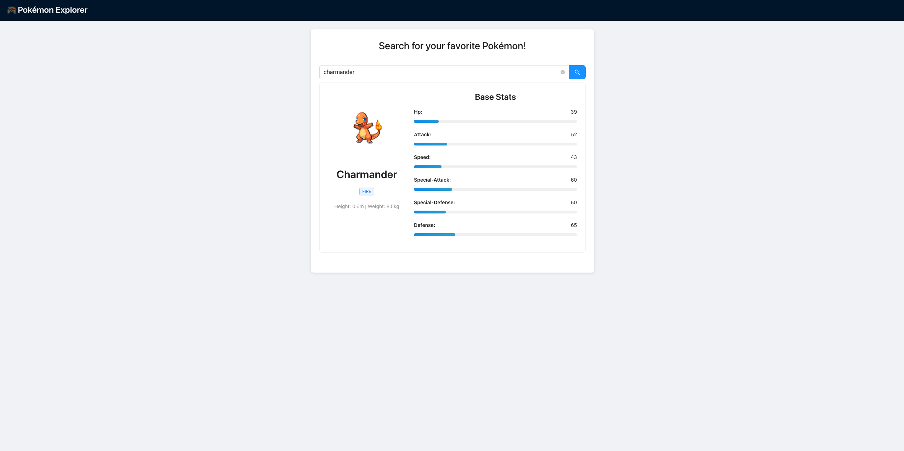

# Pokémon Explorer: Your Frontend Debugging Dojo

Welcome to the chaos lab where we intentionally break things so you can learn to fix them. This isn't your typical React app—it's a carefully crafted debugging playground designed to sharpen your frontend problem-solving skills.

Built with Vite + React + TypeScript, Ant Design, and Atomic Design principles, this app fetches Pokémon data from the PokeAPI. But here's the catch: it's riddled with bugs, both real and intentional, waiting for you to discover and understand.



*The app in action: Search for Pokémon, discover bugs, learn debugging.*

## Bugs (Challenges)

Your mission: identify them, understand their root causes, and document your findings. There may be one bug we didn't list. If you find it, we owe you bragging rights.

### API Issues
- [ ] **Limited Pokémon Access**: Only the first 150 Pokémon load, even though 1300+ exist
  - *Potential cause: API pagination logic or data fetching limits*
  - *Consequence: Users miss out on most of the Pokémon universe*

- [ ] **Duplicate API Calls**: The app hits the API twice on initial load
  - *Potential cause: Multiple useEffect hooks or component re-renders*
  - *Consequence: Unnecessary network traffic and potential rate limiting*

- [ ] **No Debounce + Overeager Search**: API calls trigger on every keystroke instead of waiting for user action (search button or autocomplete selection)
  - *Potential cause: Missing debounce implementation + autocomplete calling API on input change instead of user selection*
  - *Consequence: Massive API abuse, poor performance, and potential rate limiting*

### UI/UX Bugs
- [ ] **Random Error Messages**: Failed searches show confusing, unhelpful messages
  - *Potential cause: Generic error handling or incorrect error mapping*
  - *Consequence: Poor user experience and debugging confusion*

- [ ] **Silent 404 Failures**: Search for a non-existent Pokémon and watch... nothing happen
  - *Debugging angle: Error handling, API response processing, state management*
  - *Learning goal: Understand how to catch and handle API errors gracefully*

- [ ] **UI Flicker**: Search for a new Pokémon and see the old one flash briefly
  - *Debugging angle: Component lifecycle, state transitions, loading states*
  - *Learning goal: Master the art of smooth UI transitions*

### State & Lifecycle
- [ ] **Stat Swapping**: Speed and defense stats are mysteriously swapped
  - *Debugging angle: Data transformation, mapping logic, API response structure*
  - *Learning goal: Trace data flow from API to UI display*

### Type Safety Problems
- [ ] **TypeScript Assumptions**: The app assumes optional fields are always present
  - *Debugging angle: Type definitions, runtime safety, optional chaining*
  - *Learning goal: Bridge the gap between TypeScript types and runtime reality*

## How to Think Like a Debugger

### Sharp Practices for Faster Debugging

**Start with the obvious, not the exotic**
- Check the console first. Seriously. Most bugs announce themselves loudly.

**Reproduce the bug three different ways**
- If you can't trigger it consistently, you're probably debugging the wrong thing.

**Narrate your debugging process out loud**
- Your brain catches flawed assumptions when you have to explain them to someone (even if that someone is your rubber duck).

**Debug without logs first**
- Force yourself to trace the code manually. It builds mental models faster than console.log ever will.

**Question your debugging tools**
- Don't just use the debugger—understand why it's showing you what it's showing you.

**Keep a debugging journal**
- Write down your false leads and dead ends. Pattern recognition is your superpower.

## Quick Start

Clone the repo, install dependencies, and fire up the dev server.

```bash
npm install
npm run dev
```

Open http://localhost:5173 and start breaking things (or rather, finding what's already broken).

## Directory Overview

```
src/
├── api/                # Axios setup and API calls
├── components/         # Atomic Design structure
│   ├── atoms/         # Basic UI elements
│   ├── molecules/     # Component combinations
│   ├── organisms/     # Complex components
│   ├── templates/     # Layout structure
│   └── pages/         # Route-level views
├── stores/            # Zustand state management
├── styles/            # SCSS modules
└── types/             # TypeScript definitions
```

## Learning Goals

By the time you're done with this app, you should be able to:

- **Spot the difference** between real bugs and intentional ones
- **Trace data flow** from API response to UI display
- **Debug state management** issues in complex React applications
- **Handle API errors** gracefully and informatively
- **Optimize performance** by identifying unnecessary re-renders and API calls
- **Think systematically** about debugging instead of guessing
- **Document your debugging process** for future reference
- **Explain your fix to someone else** to test if you truly understand it

Remember: The goal isn't to fix everything perfectly. It's to build the debugging instincts that will serve you in real-world development. Happy hunting!

## License

This project is licensed under the MIT License - see the [LICENSE](LICENSE) file for details.

---

## Recommended Reading & Debugging Resources

These articles go deeper into the strategies and mindset that will make you a more effective frontend debugger.

### **How to Debug CSS**
*by S. Mustaf*
Covers CSS debugging techniques, common styling issues, and how to use browser DevTools to troubleshoot layout and styling problems effectively.
[Read it here](https://medium.com/@s.mustaf.m/how-to-debug-css-5aa17307267a)

### **Practical Debugging Guide: The Art of Solving Frontend Problems**
*by João Victor*
A comprehensive guide covering Chrome DevTools mastery, React debugging techniques, unit testing strategies, and security best practices for effective frontend problem-solving.
[Read it here](https://dev.to/fonteeboa/practical-debugging-guide-the-art-of-solving-frontend-problems-15p5)

### **Stop Googling: How AI Changed the Way I Debug Frontend Code**
*by JavaScript in Plain English*
Discusses how modern devs are pairing intuition with AI tools (like ChatGPT) to form better hypotheses, understand unfamiliar codebases, and debug faster.
[Read it here](https://javascript.plainenglish.io/stop-googling-how-ai-changed-the-way-i-debug-frontend-code-bcb86946594c)

### **5 Common Types of Frontend Bugs and How to Debug Them**
*by José Matos*
Covers recurring frontend bugs—like async race conditions, re-render issues, and DOM manipulation problems—and how to spot them quickly in the wild.
[Read it here](https://blog.josematos.work/5-common-types-of-frontend-bugs-and-how-to-debug-them-b0e8de38166e)

### **Understand the Basics of Frontend Debugging and Troubleshooting**
*by Bikash Halder*
A foundational guide covering essential debugging concepts, common troubleshooting techniques, and systematic approaches to solving frontend problems.
[Read it here](https://medium.com/@bikashhalder002/understand-the-basics-of-frontend-debugging-and-troubleshooting-ffe6fb8b4a44)
